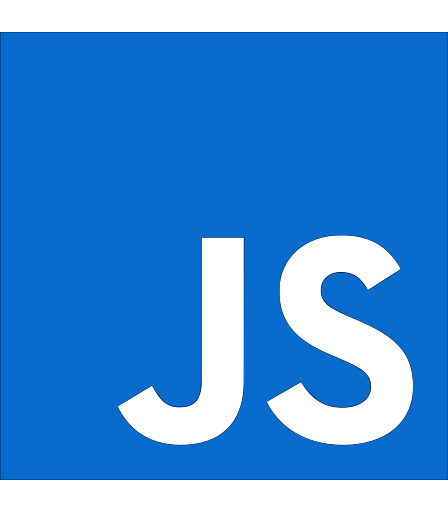

## Hi!, I'm Adam. I live and develop applications in Melbourne Australia

### I learn the most when I am making applications

### Here are some of the tools I use...

  

    
    <h3 Style="padding-left: 1rem">HTML</h3>
  

  

    
    <h3 Style="padding-left: 1rem">CSS</h3>
  

